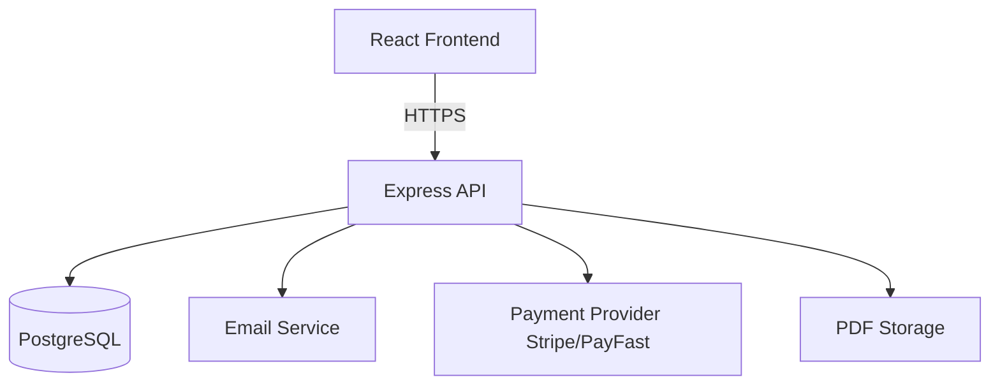

# System Diagram



## Local development

- **Start database**:

```bash
docker compose up -d db
```

- **Environment variables**:
  - `backend/.env`: `DATABASE_URL`, `JWT_SECRET`, `FRONTEND_URL`, `STRIPE_SECRET_KEY`
  - `frontend/.env`: `VITE_API_URL`

- **Run migrations**:

```bash
cd backend
npm run prisma:generate
npm run prisma:migrate
```

- **Run apps**:

```bash
cd backend && npm run dev
cd frontend && npm run dev
```
